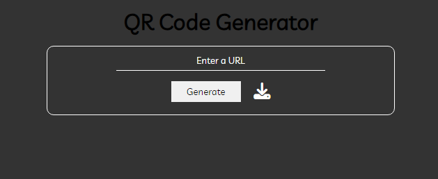

# QRCode Generator



## Description

QRCode Generator is a web application that enables users to generate QR codes for URLs. Users can input any valid URL, and the application will generate a corresponding QR code that can be downloaded or scanned using a QR code reader.

## Demo

Try out the live demo of the QRCode Generator [here](https://nothearty.github.io/qrcodeGenerator/).

## Features

- User-friendly interface: Input a URL and click "Generate" to create the QR code.
- Download QR code: Users can download the generated QR code as a PNG image.

## Installation

1. Clone the repository: 

```http
  git clone https://github.com/nothearty/qrcodeGenerator
```

2. Open the index.html file in your web browser.

## Usage

1. Enter a valid URL in the input field.

2. Click the "Generate" button to create the corresponding QR code.

3. The generated QR code will be displayed on the screen.

4. Optionally, click the download button to save the QR code as a PNG image.

## Technologies Used

- HTML
- CSS
- JavaScript
- [GoQR API](https://goqr.me/api/)

## Contributing

Contributions are welcome! If you have any ideas for improvements or new features, feel free to open an issue or submit a pull request.

